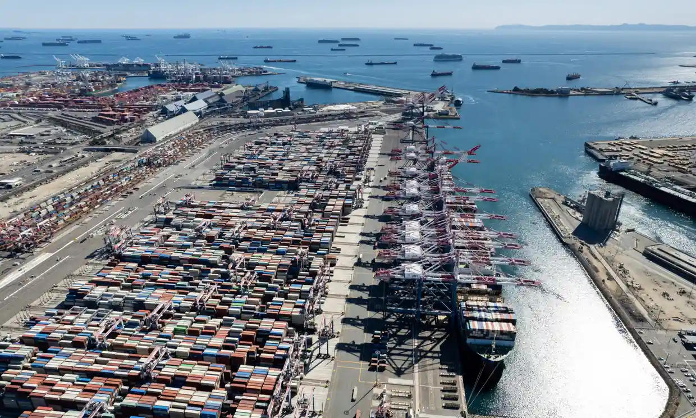
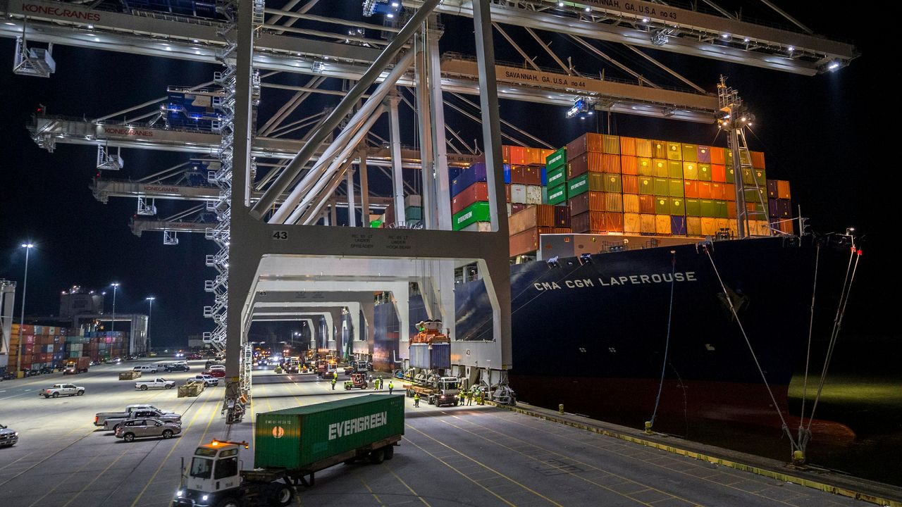
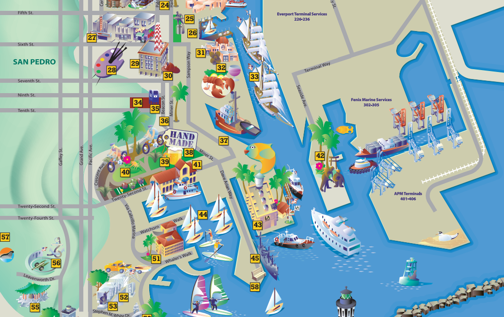
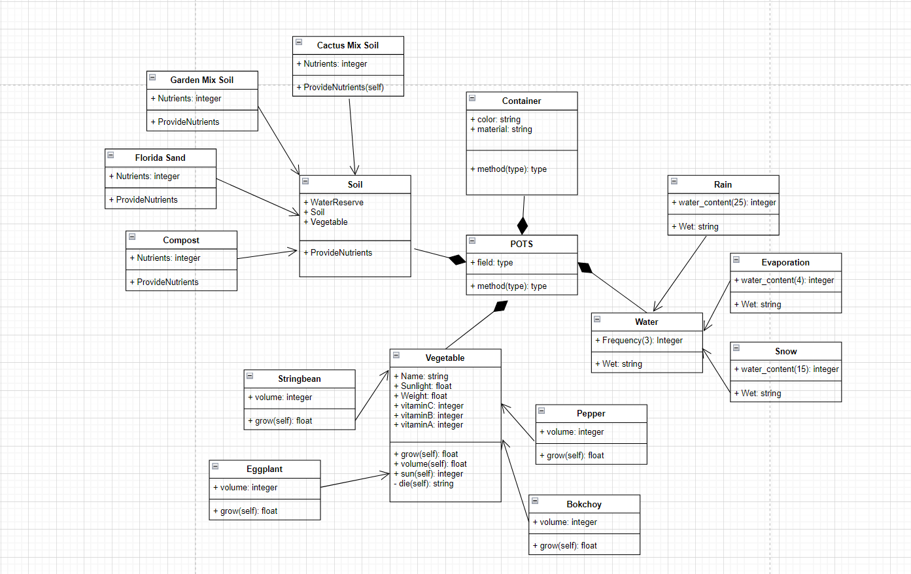
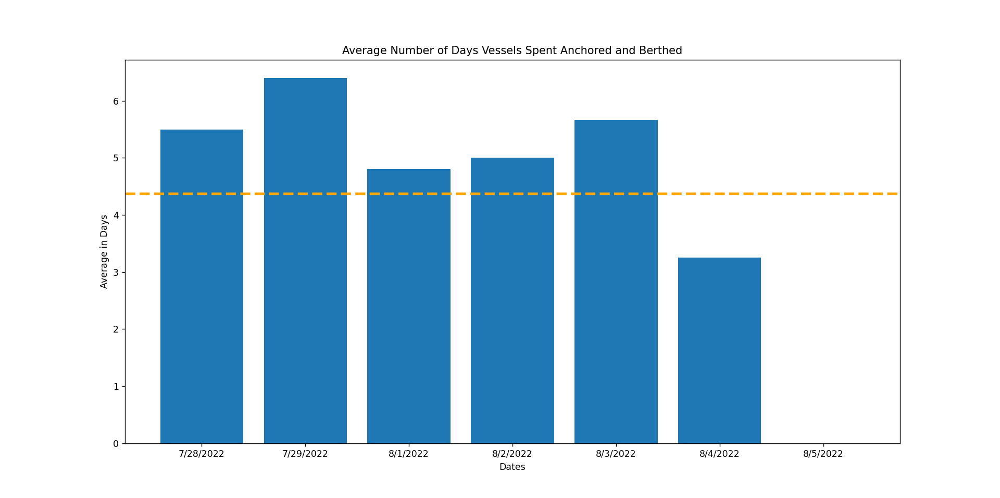
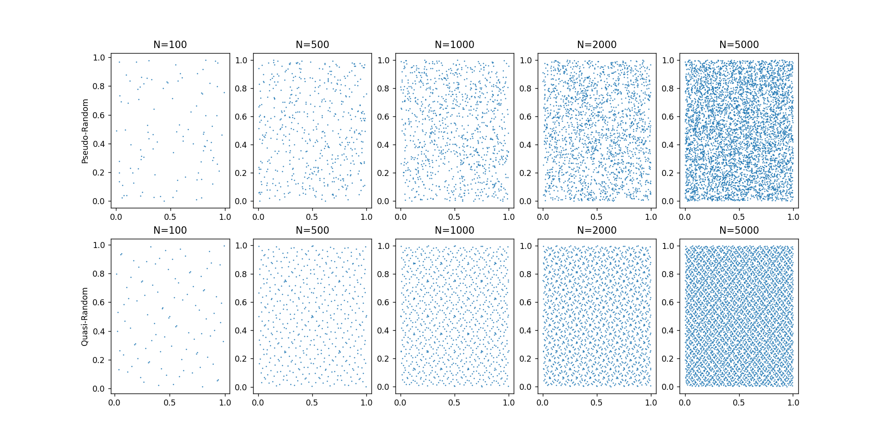
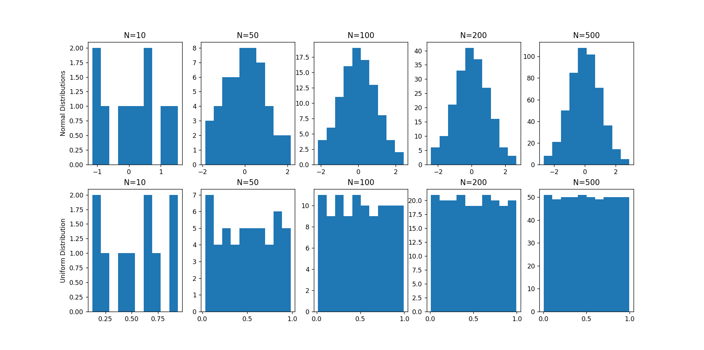

# Assignment 1 - Designing Models and Analyzing Data

> * Participant name: Maxwell Stolarenko
> * Project Title: **Modeling Maritime Ship Docking Backlogs**

**This repository is a reupload of a project I worked on as a Modeling and Simulation graduate student at the University of Central Florida to allow for public access. All work shown here was written by me.**

# General Introduction

The first part of this assignment explores designing models. We also look at some tools we will use in the semester -  basic Python/Git features.

We will look at **Modelling Port Traffic**. This is broadly defined as complex maritime operations which include (many) container shipping vessels, cargo handling, and general maintenance. Marine ports often have more significant socio-economic impacts that affect the imports/export supply chain, the local environment, and human resources needed for operation.  We will examine how marine ports can be modeled and simulated for various applications to better plan, understand, and assess these various challenges ports face. Many recent events are causing a surge in issues for short and long-term operations creating a need to improve America's port operations and logistics. This semester we will look at a few of these challenges, how can we design ports, routes, and schedules to make them more optimized, safer, and efficient?

The second part of the assignment explores data analysis. Data analysis and visualization are key to both the input and output of simulations. This assignment explores different random number generators, distributions, visualizations, and statistics. Additionally, it will look at getting you accustomed to specifying input and output variables to a system. We will also practice working with identifying and using real data.

# Part 1: Designing a Model - Maritime Transportation System

### Motivations

My motivation going into this project is to better understand the maritime shipping procedure and determine which components of the shipping process can pose a significant risk if circumstances were to disrupt it. I find it interesting how global trading can significantly slow down or come to a complete halt from even the smallest of disruptions to the standard chain of operations. The entire maritime shipping industry depends on each component moving smoothly and so much as one certain disruption could have severe consequences. It is important to identify where in the marine trading system do these shortcomings appear and determining what can be done to alleviate those issues. If it is a lack of proper equipment, then how do we go about securing an adequate amount. If it is a manpower shortcoming, then which jobs in the maritime industry need to have more people?

### Real World Examples

During most of 2021 and the first half of 2022, the Port of Los Angeles suffered from a constant excessive backlog of ships awaiting to dock into their port to unload cargo and transport out new cargo to keep traffic flowing. Certain days had over 90 ships in queue to dock at the Los Angeles ports with average queue times lasting as long as two weeks. Luckily the Los Angeles port has significantly reduced its daily average backlog since the beginning of this year but caution should be exercised as a similar situation could occur again next year.

**Image Credit** - Backlog of cargo ships at southern California ports reaches an all-time high [The Guardian] (2021)

While Los Angeles is finally getting itself back on schedule, we are noticing other ports continue to suffer from excessive backlogs or beginning to have backlog issues of their own. The Port of Savannah is one port that had low queue times but has steadily increased over the past few months. Both as a combination of the port still recovering from COVID-19 operations, reduced manpower, and increased demand from the approaching holiday season.

**Image Credit** - Container Ship Backlog Grows Again at the Port of Savannah [The Wall Street Journal] (2022)

### Historical Context

Maritime Trading is still recovering from global disruptions caused by Covid. Borders gradually reopening is encouraging more countries to engage in ocean trading, as well as the lack of workers in various required fields like land transportation, cargo inspection, ship crew, and overall skilled workers in many other fields. An insufficient amount of particular maritime workers as well as inexperienced workers gradually slow down the docking and unloading process, causing a chain reaction where ships are left waiting for other ships to finish.

### Proposed Solution

Some shipping ports have noticed the decline in workforce across different roles with not enough new skilled workers coming in and have opted to use looser hiring requirments to hire people for certain roles like cargo inspection. This is an ineffective solution that will only cause further delays as the chance of something going wrong only increases with the number of inexperienced workers. Other solutions must be evaluted.

## (Part 1.1): Requirements (Experimental Design) **(10%)**

I specified my topic as **Modeling Maritime Port Backlogs**. What this means is to observe and evaluate aspects revolving around the queue times it take for maritime shipping vessels to dock into a port, unload their current cargo, refuel, receive new shipments of cargo from the harbor, and depart back to the sea. A major problem maritime ports face is the inability to keep up with sudden influxes of incoming cargo ships in bursts. Another problem maritime ports face is the difficulty in realigning their schedule in the event something takes longer than expected, whether it takes longer than usual to load/unload cargo, takes longer to dock a ship, or takes longer to receive clearance from the control center. 

With simulations, I hypothesize I can address effective solutions to the mentioned problem facing maritime port backlogs by manipulating key actors throughout the system. I can simulate how much of a domino effect can occur if someone in a particular role does their expected tasks poorly. I can also manipulate actors at different levels of clearance to see how far down the chain of command can significant delays originate from. As such, the inputs and respective functions for the system are the several different workers in maritime shipping, including ship personnel like upper deck captains who communicate directly with the port's control center and the lower deck engineers that maintain the ship's physical condition, or the port personnel like the control center operatives who guide ships in and out of the port and cargo management who inspect each container's content and ensures cargo is properly loaded and unloaded from ships.

## (Part 1.2) Maritime Ship Docking Backlogs Model **(10%)**

* [**Object Diagram**](model/object_diagram.md) - provides the high level overview of components
* [**Class Diagram**](model/class_diagram.md) - provides details of what each personnel's roles are.
* [**Behavior Diagram**](model/behavior_diagram.md) - provides details of the sequence from a ship arriving to a port to exitinga port
* [**Agent / User case**](model/agent_usecase_diagram.md) - provides details of the different types of interactions between upper deck vessel workers like the captain with control center operatives to figure out the best possible plan compared to the information accessible to people workers with less clearance.

## (Part 1.3) Maritime Ship Docking Backlog Simulation **(10%)**

I would simulate my problem by using a discrete-event based simulation, as the primary objective of my experiment is to evaluate how small but specific alterations in speed and quality of performance can have rippling effects across the rest of the port’s processes. Discrete-event based simulation can be used to better evaluate to what extent key changes in behavior of some individuals can affect the day to day processes and scheduling of all transport ships.
The inputs for the simulation would include the different type of workers found across the maritime port landscape, both on dry land and on the cargo vessels themselves. In theory we could input average completion times of tasks for each job and modify certain tasks to take longer than anticipated. Doing so should provide us outputs such as how many ships are backed up by the end of each day waiting for their entry.
The hypothesis from this is that small delays across the crew responsible for allowing ships to dock at a port accumulate over time, with each minor delay setting the port further and further behind, until eventually the port suffers from a backlog of ships awaiting entry.

## (Part 1.4) Maritime Ship Docking Backlog Code **(10%)**
[**Code template**](code/README.md) - Starting coding framework for the evergrowing backlogs in maritime ports.
You are expected to create 5 python files that implement just the structure/behavior of your system - **the code should run without errors**, create an object(s) for your system, and print out that objects were created, but not provide much functional detail at this stage to anything meaningful. (*we are just demonstrating how to translate models into skelton code and you can do basic operations in Python.*)

## (Part 1.5) Specifying the Inputs to a System **(10%)**

### Independent and Dependent Variables 
Some of the independent variables I intend to look at in my built environment include the number of workers, number of skilled workers, number of inexperienced workers, and workers for different fields of maritime shipping such as a shortage on cargo inspectors or not enough control center operators. The dependent variables of my built environment model on backlogged maritime ports include the average wait times of ships in queue before they enter a port, the frequency of accidents anywhere on site as a result of lack of experience or training.

### Data Source
Data for my built environmental model of a backlogged maritime port will come from real empirical data. I have already secured a timeseries data set on the average number of days ships were queued at a particular port, I intend to find data on the workers themselves as well.

### Statistics
Two types of statistics stand out as the most useful for capture my desired input data. I believe frequency distributions and variability will be useful for determining how often small delays occur on a daily basis, as well as the average number of times these delays occur and how they compare to the number of ships waiting in queue for a port.

### Analyzing Data Output
I intend to analyze the output of my model by simulating several different conditions in which individuals in key roles experience minor setbacks in their work. I can evaluate these micro delays and see which job role contributes the most to delaying ships.

### Visualzing Data
For visualizing my data, I believe graphs would be the most helpful. I can use histograms and bar charts to visualize the average number of delays by individuals and compare it to the daily number of delayed ships.

### Infographic Considerations
A highly effective way to visualize my output through an infographic is to build an infographic shaped like a maritime port. Examples of such already exist, such as an infographic for the Port of Los Angeles from 2020 that visualized the role of each section of the port while also including essential statistics in another infographic.

**Image Credit** - Port of Los Angeles [2020]

# Part 2: Creating a Model from Code

## (Part 2.1) **P**ortable **O**rganic **T**rouble-free **S**elf-watering System (**POTS**) Model **(10%)**
Here [**we provide an overview**](code/POTS_system/README.md) of the **P**ortable **O**rganic **T**rouble-free **S**elf-watering System (**POTS**) Model and provide a source code template for the code found in  [**the following folder**](code/POTS_system/). Please create a **class** diagram of this model (replace the placeholder diagram). (you can use paper and pencil or a digital tool).

# Part 3: Data Analysis

## (Part 3.1) - Real Data **(10%)**

The following is a visualization of a selected portion of a timeseries data source that looks at the cargo unloading portion of my model.
Source code to replicate the below diagram can be found in [code/assignment1-3.1code.py.](https://github.com/IDS6145-Fall2022/assignment-1-mse-mstolarenko/blob/main/code/3.1-RealData/assignment1-3.1code.py) Source code must be run with the 7-day portion of the timeseries data source found in [data/7-dayAVG.csv.](https://github.com/IDS6145-Fall2022/assignment-1-mse-mstolarenko/blob/main/data/7-dayAVG.csv) The data presented in this table closely fits into my system by giving me a quick overview of how common it is for maritime shipping vessels to wait outside of ports for excessive periods of time. The more time a ship spends in anchor outside of a port, the more congested the port becomes.

**Trends in the 7-Day Dataset**
- Based on the average across the 7-day period, ships were on average waiting approximately 4.3 days before being granted access to dock into the Port of Los Angeles. Vessels spent roughly 103.2 that week either stationary outside the port (anchored) or perpendicular to the port (berthed).
- Most of the observed days had an average vessel waiting time above the mean, suggesting that the Port of Los Angeles was operating slower than expected.
- 7/29/2022 saw the highest average amount of time vessels spent waiting to dock into the Port of Los Angeles. 7/29/2022 was a Friday, suggesting that Fridays typically see higher levels of incoming shipment than other days in the week.
- The days 7/30/2020 and 7/31/2022 were omitted from the dataset. These two days were Saturday and Sunday, suggesting the port is likely closed on weekends. This in tandem with 7/29/2022 having the longest wait times suggests that there is a increased volume of ships arriving at the port before the port closes for the weekend.
- 8/4/2022 was a steep reduction in the average number of days spent waiting to dock and 8/5/2022 reported that ships were not held up at all. More days have an average of 0 days for vessel waiting in the full year dataset, but they do not occur consistently or follow a particular pattern.
- The 7-day dataset is primarily skewed right with the larger values mostly congregated to the left of the diagram.

## (Part 3.2) -  Plotting 2D Random Number Generators **(15%)**

This portion of the assignment looks at generating random numbers in Python and understanding how to properly plot them. Plot two different random number generators, pseudo-random, and quasi-random, for five different N values. There should be 10 subplots, all properly formatted 2D plots that are properly scaled. Note, each of the N points will have two coordinates, an x, and a y, therefore you will need to generate two random numbers for each point. You should replace the image with your results in a similar format. Discuss how the patterns differ. Feel free to change the N values from the suggested N values in the image to state your case.

>[Source Code](https://github.com/IDS6145-Fall2022/assignment-1-mse-mstolarenko/tree/main/code/3.2-RandomNumber)

**Pattern Differences Between Pseudo-Random and Quasi-Random**
The most notable difference between psuedo-random and quasi-random number generation is the arrangement points differ. 
- Psuedo-Random number generation places each point at completel random, meaning that two points could in theory take the same space or have next to no gap between another point. This causes pseudo-random scatterplots to have regions in their diagram where several points cluster or clump close together.
- Quasi-Random number generation creates a uniform amount of distance between each point. In doing so, each point is equally spaced apart and will never touch one another unless there is no more space in the diagram to maintain distance. As the sample increases in size, the equally-spaced pattern becomes more and more apparent.

## (Part 3.3) -  Plotting 1D Random Distributions **(15%)**

Now, choose two different distributions to plot in 1D, (or as a histogram). Choose a pseudo-random generator and generate two different distributions. Example distributions are Uniform, Normal, Exponential, Poisson, and Chi-Squared, but feel free to use any distributions of your choice. Again, plot each distribution for five different Ns. This will result in 10 different subplots, formatted similar to the image in Part 3.2. Include your *properly formatted* 1D plots below and briefly describe what we are looking at and how things change as N is changed.

>[Source Code](https://github.com/IDS6145-Fall2022/assignment-1-mse-mstolarenko/tree/main/code/3.3-1dRandomNumber)

###Description of Diagrams & Patterns

When the sample size is low, there is no pattern or simlar traits between each type of distribution. As the sample size increases to 50 and beyond however, the outlines of the distributions begnin to resembles something more familiar. Increasing N can either generate a raw set of values that even out across all possible values (giving you a uniform distribution where each value has an equal chance of occurring). The other pseudo-random generation distribution arranges data in a manner most closely resembling a normal distribution. At lower N values, the distribution starts without much pattern but by N = 50 the distribution resemblesm a normal curve with a slight skew to the right.By N = 100, a majority of data values converge to the center of the distribution with an equal distribution of lesser values surrounding the middle, forming a near perfect normal curve.