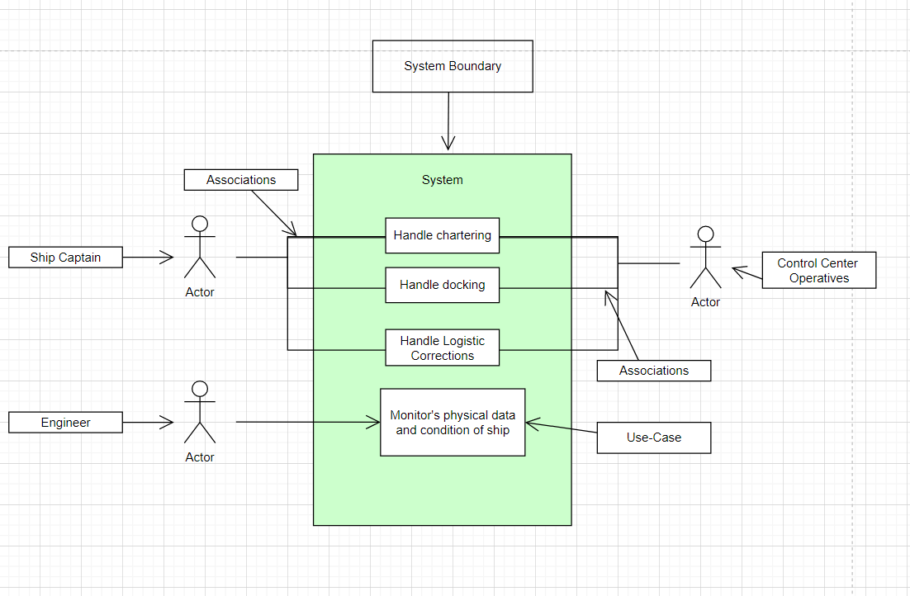

# Use-Case Diagram of Modeling Maritime Port Backlogs

The following diagram shows the different types of interactions that occur on a shipping vessel. The captain will often interact with the control center operatives stationed at the port their ship is heading towards, to get a better understanding of the port's condition and docking availability before arriving at the port. It helps the control center to know of a vessel's arrival well before itis within proximity of the port to give the captain and their crew a general estimate wait time if there is any.

In contrast, the engineers of the vessel will hardly ever interact with control center operatives when performing their maritime duties, if ever. This shows a use-case paradigm where the information presented to a certain user will vary based on their credentials. The engineers of the vessel are highly trained to identify and diagnose any potential issues with the physical components of the ship, but when it comes to the logistics of the ship, that is a matter more in tune with the dynamic between the ship's upper crew and the upcoming port's terminal staff.