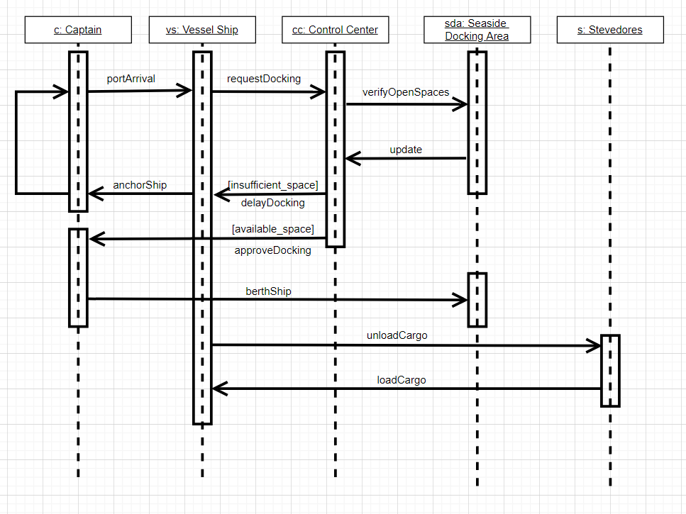

## Maritime Cargo Unloading Backlog - Behavior Diagram

The following sequence diagram provides a detailed overview of the step-by-step process shipping vessels and the port itself go through each time a ship arrives to the port for docking.

The procedure begins with the captain navigating the ship to their intended destination, the port. They then hail the control center of that port for entry to unload their cargo. The control center notices the captain and their ship's arrival and decides whether or not to let the captain's ship in based on the availability of spaces in the port's docking area. In the event that there are already too many ships docked, the control center will instruct the captain to anchor their vessel outside of the port until space becomes available. This process repeats itself until sufficient space is available.

When there is available space, the captain prepares their ship to berth against the port, preparing it for cargo unloading. Sever stevedores are summoned to the ship to unload the ship's current cargo as well as readying the ship for cargo loading. Once new cargo is loaded onto the ship, the captain prepares the ship for exit from the port.

It's important to note that insufficient space causing the captain to wait could be caused by any number of factors, such as the accumulation of small but frequent delays.
