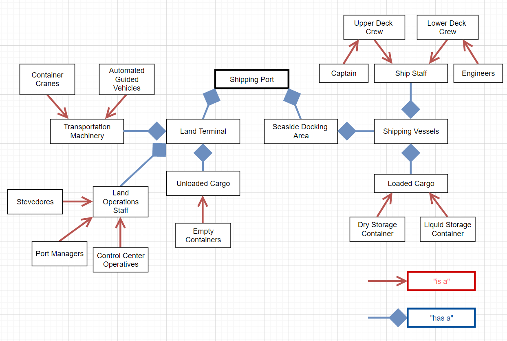
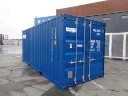
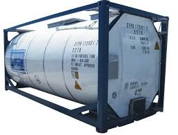

## Smart City Cargo Loading Model - Object Diagram

The following model is an object diagram providing a general overview of many components and characteristics that comprise
a typical shipping port. Multiple relationships are established between elemenents and further explained below.

The following object diagram is initially split between two main categories of a maritime shipping port. The left-hand side of the diagram shows the elements and characteristics of the port itself as it prepares for incoming vessels. A typical port has machinery responsible for moving shipping containers from the port to readied ships, such as cranes and guiding vehicles. A land terminal also consists of dedicated workers stationed around the land terminal, such as stevedores to unload and load cargo vessels, control center operatives to navigate incoming and outgoing vessels to their appropriate landing areas, and port managers that oversee the entire port logistically and financially.

The other half of the object diagram describes the shipping vessels coming into the port from other regions. This right half establishes what is aboard the incoming vessel, namely the physical contents of its containers as well as the personnel operating the vessel. Loaded cargo typically comes in a few different types of containers. Dry storage containers are used to store general goods such as electronics, food, and bulky equipment. Whereas ISO tanks, or liquid storage containers, are specially built to contain hazardous materials like raw chemicals or crude oil.

 

**Image Credit** - The 8 Most Common Types of Containers [Tec Container]

Shipping vessels also have ship staff, or the crew members that are responsible for navigating the cargo vessel to a desired port for dropping off containers. Ship staff are usually divided into one of two categories: upper deck crewmates and lower deck crewmates are forms of ship staff. One noteworthy upper deck crewmate is the ship's captain, responsible for communicating with port and fellow ship networks to safely navigate waters. One noteworthy lower deck crewmate are the ship's engineers, responsible for maintaining the vessel's condition.

The importance of defining these elements and relationships is to show that each component is vital to a smooth transition between a vessel's arrival to a port, to its unloading of arrived cargo and loading of standby cargo, to the vessel's departure. If any part of this object diagram experiences issues or technical difficulties, it could contribute to delays in a vessel's ability to perform the above tasks, thus delaying further ships.

